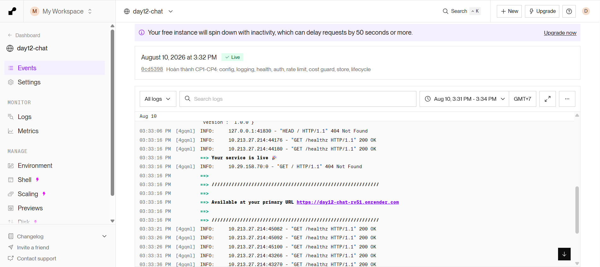
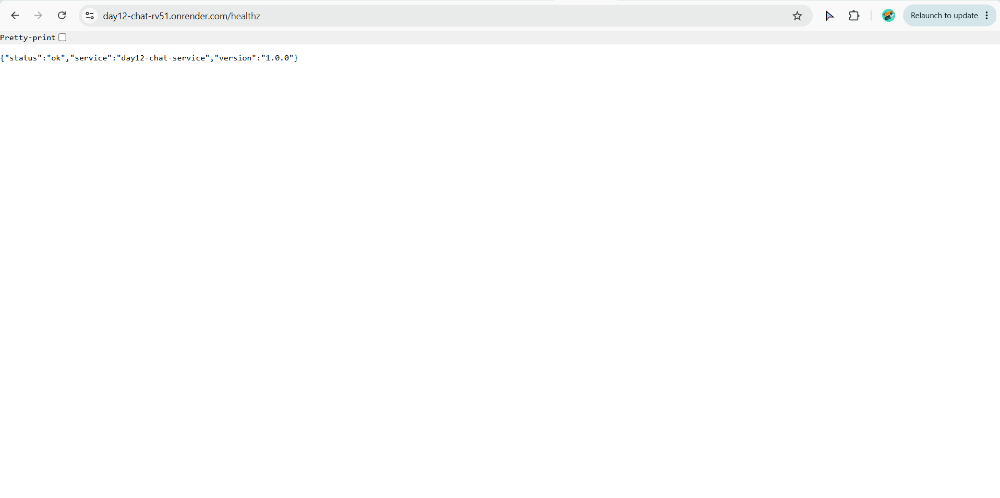

# Thông Tin Deploy — Checkpoint 5

> Điền file này sau khi deploy xong. `pytest tests/test_cp5.py` đọc file này
> để tìm địa chỉ service của bạn và gọi thử.
>
> **Chỉ ghi TÊN biến môi trường, tuyệt đối không dán giá trị token vào đây.**
> Repo này công khai — dán token vào là mất token.

## Thông Tin Học Viên

| Mục | Nội dung |
|-----|----------|
| Họ và tên | Đoàn Ngọc Linh |
| Mã học viên | 2A202601762 |
| Repo | https://github.com/ldoan23/K4-DAY12-2A202601762-DoanNgocLinh |

## Service

| Mục | Nội dung |
|-----|----------|
| Public URL | https://day12-chat-rv51.onrender.com |
| Platform | Render (Blueprint, đọc render.yaml) |
| Ngày deploy | 2026-08-10 |

## Biến Môi Trường Đã Set Trên Cloud

Ghi tên biến và **nguồn giá trị**, không ghi giá trị:

| Biến | Đã set | Ghi chú |
|------|--------|---------|
| `PORT` | ✅ | platform tự gán |
| `API_TOKEN` | ✅ | đặt trong dashboard, không nằm trong repo |
| `REDIS_URL` | ✅ | Render Key Value (day12-chat-redis), gắn tự động qua `fromService` trong render.yaml |
| `BUCKET_CAPACITY` | ✅ | 10 |
| `REFILL_PER_MINUTE` | ✅ | 10 |
| `DAILY_BUDGET_USD` | ✅ | 1.0 |
| `LOG_LEVEL` | ✅ | INFO |

## Lệnh Kiểm Tra

Thay `<URL>` bằng Public URL ở trên:

```bash
# 1. Liveness — mong đợi 200 {"status":"ok"}
curl -i https://day12-chat-rv51.onrender.com/healthz

# 2. Readiness — mong đợi 200 {"status":"ready"} (đã nối được Redis)
curl -i https://day12-chat-rv51.onrender.com/readyz

# 3. Không có token — mong đợi 401 kèm header WWW-Authenticate
curl -i -X POST https://day12-chat-rv51.onrender.com/chat \
  -H "Content-Type: application/json" \
  -d '{"message":"Hello"}'

# 4. Có token — mong đợi 200 kèm câu trả lời
curl -i -X POST https://day12-chat-rv51.onrender.com/chat \
  -H "Content-Type: application/json" \
  -H "Authorization: Bearer $API_TOKEN" \
  -H "X-Client-Id: sv-test" \
  -d '{"message":"Deploy là gì?"}'

# 5. Rate limit — gọi 15 lần, những lần cuối phải trả 429
for i in $(seq 1 15); do
  curl -s -o /dev/null -w "%{http_code} " -X POST https://day12-chat-rv51.onrender.com/chat \
    -H "Content-Type: application/json" \
    -H "Authorization: Bearer $API_TOKEN" \
    -H "X-Client-Id: sv-test" \
    -d '{"message":"test"}'
done; echo
```

## Kết Quả Chạy Thật

> Máy tôi dùng Windows PowerShell — `curl.exe` trên PowerShell 5.1 làm hỏng
> body chứa dấu `"` khi truyền cho chương trình native (lỗi đã biết của
> PowerShell), nên lệnh 3–5 tôi chạy bằng `Invoke-WebRequest` thay vì
> `curl.exe`, cùng URL và cùng ý nghĩa kiểm tra.

**1. Liveness — `GET /healthz`**

```
HTTP/1.1 200 OK
{"status":"ok","service":"day12-chat-service","version":"1.0.0"}
```

**2. Readiness — `GET /readyz`** (chứng minh đã nối được Redis trên cloud)

```
HTTP/1.1 200 OK
{"status":"ready","redis":true}
```

**3. `POST /chat` không có token** — mong đợi 401

```
Status: 401
WWW-Authenticate: Bearer
```

**4. `POST /chat` có token thật** — mong đợi 200 kèm câu trả lời

```
StatusCode: 200
Content: {"reply":"...","client_id":"sv-test","turns_before":12,"usd_cost":6.8e-05,...}
```

(chuỗi "reply" hiển thị lỗi font tiếng Việt trên console PowerShell do khác
bảng mã hiển thị — không phải lỗi dữ liệu; `turns_before: 12` cho thấy lịch
sử hội thoại của `sv-test` được lưu đúng qua Redis, không mất giữa các lần gọi)

**5. Rate limit — gọi 15 lần liên tiếp**

```
200 200 200 200 200 200 200 200 200 200 429 429 429 429 429
```

10 request đầu (đúng bằng `BUCKET_CAPACITY=10`) trả 200, 5 request cuối trả
429 khi xô hết token — token bucket hoạt động đúng trên bản deploy thật.

**6. Kết quả toàn bộ `pytest tests/test_cp5.py -v`**

```
9 passed, 4 skipped
(4 test skip thuộc TestLocalFallback — chỉ chạy khi LOCAL_FALLBACK=true,
không áp dụng vì repo này đã deploy thật lên Render)
```

## Ảnh Chụp Màn Hình

| Ảnh | Nội dung |
|---|---|
| [`screenshots/dashboard.png`](screenshots/dashboard.png) | Dashboard Render — service `day12-chat` đang **Live**, log `GET /healthz 200 OK` |
| [`screenshots/healthz.png`](screenshots/healthz.png) | Gọi trực tiếp `/healthz` trên trình duyệt — `{"status":"ok",...}` |





Không dùng phương án dự phòng — đã deploy thật lên Render (xem mục Service ở trên).
